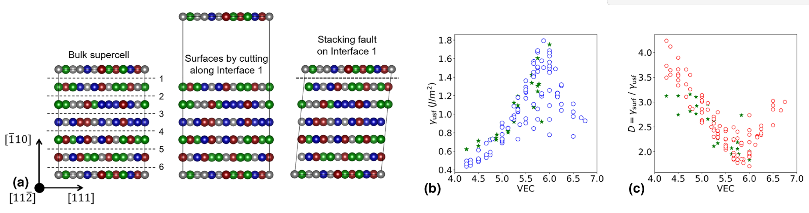

## Distribution of alloy chemistries, which was obtained from density functional theory calculations. The total dataset contains 133 allys includin binary, ternary and quaternary compositions.

## Distribution of target properties for the 133 alloys. VEC is the composition averaged 'valence electron count'.
