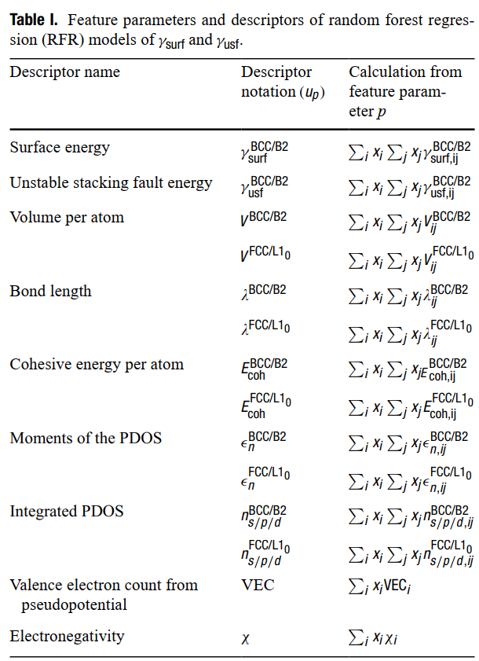
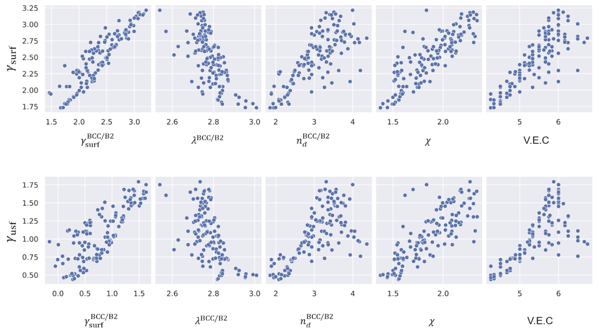
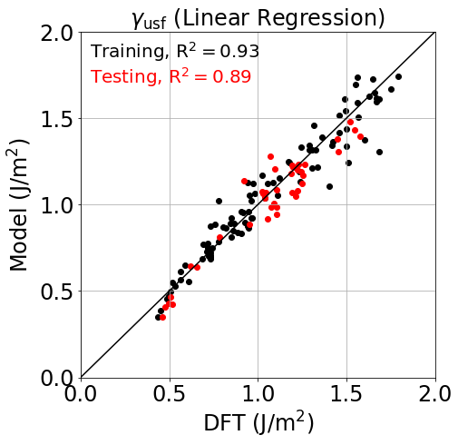
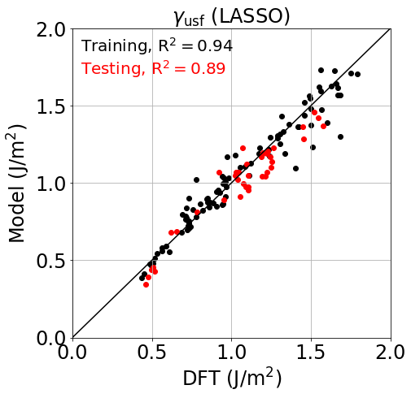
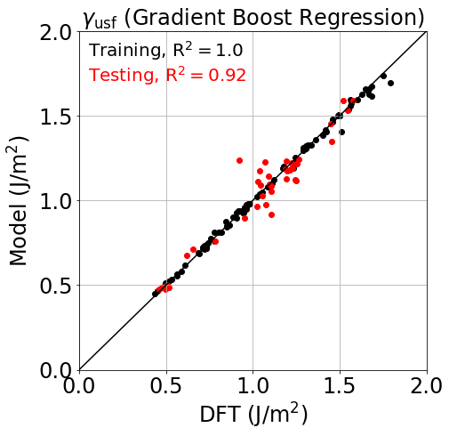
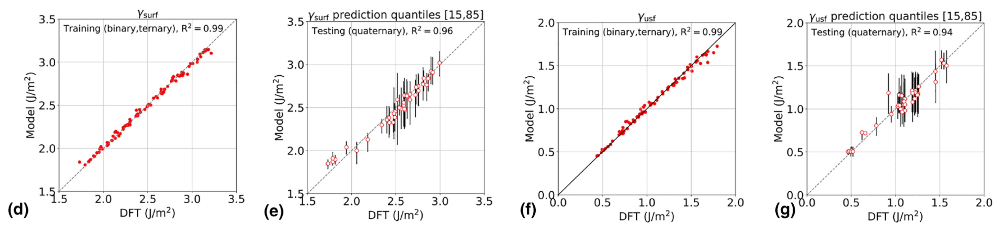

List of descriptors to model the target properties. The table lists the set of descriptors up based on alloy/metal properties p in its second column and the corresponding feature parameters in its third column, which include the feature parameters ( pijBCC/B2 and pijFCC/L10) of the first-nearest-neighbor bond between element i and j and the element properties ( pi ). xi/xj is the mole fraction of element i/j in the alloys.

Distribution of target properties with few descriptors. The descriptors are listed in the table above.

Linear regression and LASSO models result in poor predictive accuracies.

Random Forest Regression was the final model chosen for screening. (d) and (e) Training (d) and testing (e) performances for the RFR model of γsurf. (f) and (g) Training (f) and testing (g) performance for the RFR model of γusf. The training sets in (d) and (f) include data from binary and ternary alloys (red dots). The testing sets in (e) and (g) include quaternary alloys (red circles). The vertical black lines in (e) and (g) denote the [15, 85] quantile from the RFR model.
