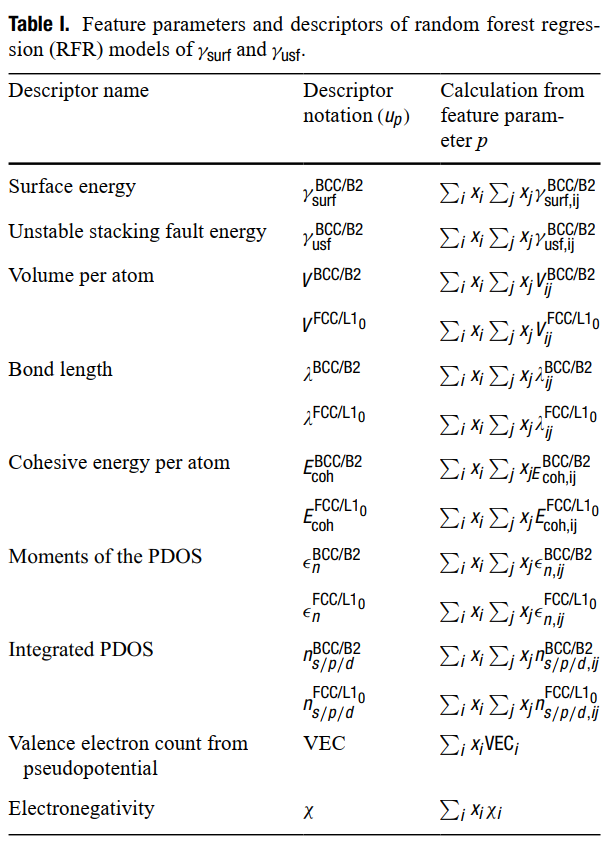

## List of descriptors to model the target properties.

## Distribution of target properties with few descriptors. The descriptors are listed in the table above.

## Linear regression and LASSO models result in poor predictive accuracies.

## Random Forest Regression was the final model chosen for screening.
