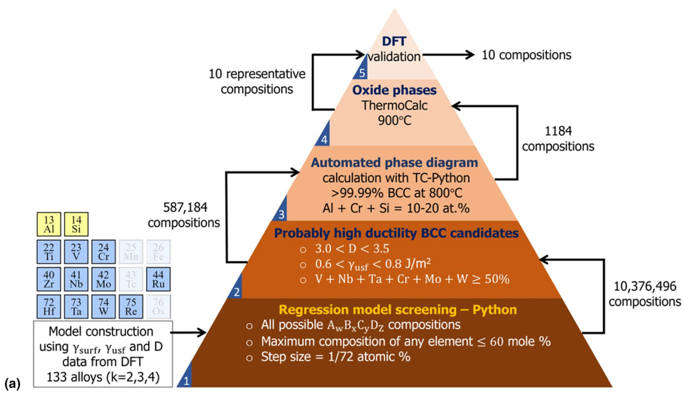

Illustration of the hierarchical screening model. (a) A multi-level pyramid to explain the 5-step model based on DFT calculations, RFR models, and CALPHAD method. Each level of the pyramid summarises the corresponding screening procedure. Detailed descriptions are provided in “Hierarchical screening framework” section. Input arrows denote the number of input compositions. Output arrows denote the number of screened/filtered output compositions. The partial periodic table and accompanying text on the left depict the RFR models of γusf, γsurf, and D, which are used to screen alloys in Step 1. Detailed results are discussed in Figure 2 of our manuscript.

